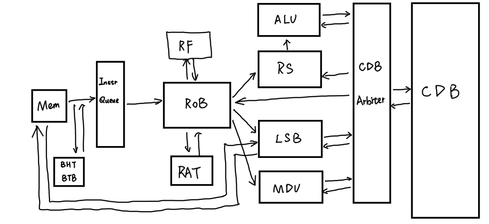

# RISC-V CPU Implementation

This repository contains the final project for the CS2957 Computer Architecture course. It features two RISC-V CPU implementations in Verilog:
1.  **Naive CPU**: A classic five-stage pipelined processor.
2.  **Tomasulo CPU**: An advanced Out-of-Order (OoO) processor based on the Tomasulo algorithm with Reorder Buffer (ROB).

Both CPUs support the **RV32I** base integer instruction set. The Tomasulo CPU additionally supports the **RV32M** extension (hardware multiplication and division).

## Draft



## Features

### 1. Naive CPU
*   **Architecture**: Classic 5-stage pipeline (IF, ID, EX, MEM, WB).
*   **Hazard Handling**: Data forwarding and stalling logic.
*   **Branch Prediction**: Static prediction.

### 2. Tomasulo CPU (Out-of-Order)
*   **Algorithm**: Tomasulo with Reorder Buffer (ROB) for In-Order Commit.
*   **Frontend**:
    *   **Fetch Unit**: Fetches instructions from memory.
    *   **Branch Prediction**: 
        *   **BHT (Branch History Table)**: 2-bit Saturating Counter for direction prediction.
        *   **BTB (Branch Target Buffer)**: Functioning as a cache for branch targets.
*   **Issue Logic**:
    *   Decodes instructions and dispatches them to Reservation Stations (RS), Load-Store Buffer (LSB), and allocates ROB entries.
    *   Handles Register Renaming using ROB IDs.
*   **Execution Units**:
    *   **ALU**: Arithmetic and Logic Unit.
    *   **MDU**: Multiplier/Divider Unit (Pipelined Multiplier).
    *   **Reservation Stations (RS)**: Buffers instructions waiting for operands. Snoops the Common Data Bus (CDB).
    *   **Load-Store Buffer (LSB)**: Buffers memory operations.
*   **Commit**:
    *   **Reorder Buffer (ROB)**: Ensures instructions are retired in program order to maintain precise exceptions.
    *   Updates the Architectural Register File (ARF) and handles Branch Misprediction (Flush).

## Directory Structure

```text
.
├── naive/                  # Naive 5-Stage Pipeline CPU
│   ├── src/                # Verilog source files
│   ├── sim/                # Simulation files
│   └── doc/                # Documentation
├── tomasulo/               # Tomasulo Out-of-Order CPU
│   ├── src/                # Verilog source files
│   ├── sim/                # Simulation files
│   └── doc/                # Specific documentation (Debug, M-Ext, etc.)
├── test/                   # Test Framework & Source Code
│   ├── src/                # C Assembly test cases
│   ├── Makefile            # Build compilation script
│   └── start.S             # Boot code
├── testcases/              # Pre-compiled test dumps and sources
├── doc/                    # General Documentation
│   ├── Instructions.md     # ISA Reference
│   └── ...
├── final_test.py           # Python script for batch testing Naive CPU
├── final_test_tomasulo.py  # Python script for batch testing Tomasulo CPU
└── README.md               # Project Documentation
```

## Prerequisites

To build and simulate the CPUs, you need the following tools installed:

1.  **Icarus Verilog (`iverilog`)**: For compiling and simulating Verilog designs.
2.  **RISC-V GNU Toolchain (`riscv64-unknown-elf-gcc`)**: For compiling C/Assembly test cases to RISC-V binaries.
    *   Ensure it supports `rv32i` and `rv32im` architectures.
3.  **Python 3**: For running test scripts.
4.  **Make**: For build automation.

## How to Run

### 1. Running Standard Benchmarks (Tomasulo)

You can run the provided automated test script which compiles test cases, builds the simulator, and verifies the output.

```bash
python3 final_test_tomasulo.py
```

This script will:
*   Build the Verilog simulator using `iverilog`.
*   Compile C test cases (like `sum`, `vector_add`, `vector_mul`) using `riscv64-unknown-elf-gcc`.
*   Run the simulation and check the result against expected values.


### 2. Running Individual Tests Manually

You can also compile and run specific tests manually. The build system uses standard Verilog Hex format (`.hex`).

#### Method 1: Compile from Source (C/Assembly) and Run

1.  **Navigate to the test directory**
    ```bash
    cd test
    ```

2.  **Compile and Generate Hex**
    Use the specific target for Tomasulo hex generation (`PROG` specifies the test case name sans extension).
    ```bash
    make clean
    make ../tomasulo/sim/inst_rom.hex PROG=vector_mul
    ```

3.  **Run Simulation**
    The `make sim` command compiles the verilog and runs vvp with the correct parameters.
    ```bash
    make sim
    ```

#### Method 2: Run with Existing Hex File

If you already have a `.hex` file, you can run the simulator directly.

1.  **Recompile Simulator (if needed)**
    If you modified the Verilog source, rebuild the simulator executable (`out.vvp`).
    ```bash
    cd test
    iverilog -o ../tomasulo/sim/out.vvp -I ../tomasulo/src ../tomasulo/sim/testbench.v ../tomasulo/src/*.v
    ```

2.  **Run Simulation with Hex File**
    Pass the path to your hex file using the `+HEX_FILE` argument.
    ```bash
    vvp ../tomasulo/sim/out.vvp +HEX_FILE=/path/to/your_program.hex
    ```


### 3. Verification of Out-of-Order Execution

To verify the OoO capability specifically (observing instruction issue vs. completion times), you can run the special `ooo_test`:

```bash
cd test && make PROG=ooo_test ../tomasulo/sim/inst_rom.hex

cd ../tomasulo/sim && iverilog -g2012 -I ../src -o testbench.vvp testbench.v ../src/*.v && vvp testbench.vvp +HEX_FILE=inst_rom.hex > ../../test/simulation.log
```
Check `simulation.log` for `[ISSUE]` and `[COMPL]` timestamps.

## Contributors
*   Yihan Zhu : Tomasulo CPU Implementation, Branch Prediction, Test Framework, Documentation
*   Jiaqi Xu : Tomasulo CPU Architecture Design, M-Extension, Debugging