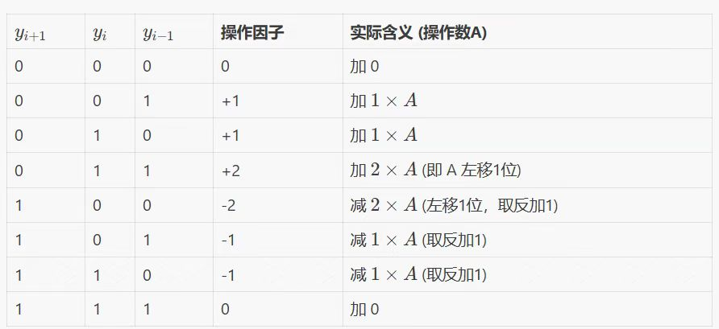

# Tomasulo RISC-V CPU 分析报告
## 1. 架构设计
本项目实现了一个基于 Tomasulo 算法 的乱序执行 RISC-V CPU。在此基础上，加入了分支预测与m-extension功能。

### 1.1 核心组件与流水线
流水线分为以下五个主要逻辑阶段：

- 取指 (Fetch): fetch_unit 从内存获取指令，包含指令队列 (IQ) 和分支预测器。
- 发射/译码 (Issue/ID): issue_unit 顺序译码并重命名寄存器。通过 重排序缓冲区 (ROB) 和 寄存器别名表 (RAT) 消除 WAW 和 WAR 相关。
- 执行 (Execute): 
    - RS_ALU: 处理算术逻辑运算。
    - RS_MDU: 处理乘除法运算。
    - RS_Branch: 处理分支和跳转。
    - LSB: 处理内存访存，实现地址计算与冲突检测。
- 写回 (Write Back): 运算结果通过 公用数据总线 (CDB) 广播给所有等待该 Tag 的保留站和 ROB。
- 提交 (Commit): 根据 ROB 的顺序按序提交，确保异常处理的精确性和状态一致性。

### 1.2 关键参数
- ROB 大小: 16
- ALU 保留站: 8
- MDU 保留站: 4
- LSB 大小: 8

## 2. 性能优化机制
### 2.1 寄存器重命名 (Register Renaming)
通过 RAT 将逻辑寄存器映射到 ROB 条目，解决了WAR/WAW问题。后续指令在前面的指令尚未写回寄存器堆时，可以直接从 CDB 捕获数据或使用 ROB Tag 占位。

### 2.2 乱序执行与数据转发
在Tomasulo 算法中，只要操作数就绪，指令即可进入执行单元 (FU) 执行。结合 CDB 的广播机制，结果数据可以在产生的下一周期立即被依赖指令使用，极大地缩短了数据依赖链造成的停顿。

### 2.3 分支预测与推测执行
在 fetch_unit 中集成了分支预测机制。指令在提交阶段验证预测结果。若预测失败，ROB 将触发全局 flush，清空所有推测执行的状态并恢复正确 PC，从而支持推测执行。

### 2.4 访存优化 (LSB)
在多周期访存环境下，LSB 能够通过顺序管理访存请求缓冲未完成的 Load/Store 指令，减少对流水线前端的阻塞。

## 3. M-Extension 设计
M 扩展指令指的是乘法、除法与取模。包含了以下指令：
- 乘法: MUL, MULH, MULHSU, MULHU
- 除法: DIV, DIVU
- 取模: REM, REMU

### 3.1 乘法器 (Multiplier)
乘法器采用了高速乘法器设计，并且避免了直接使用 Verilog 运算符 *：

乘法器使用了两种算法：
- Booth 编码：扫描乘数的三位，根据以下表格选择权重并进行左移、取反加一、置零等操作，生成部分积。

- Wallace 树压缩：使用全加器，可以实现3:2的压缩，将多个部分积并行压缩为两个最终向量 (Sum 和 Carry)。最终获得两个64位向量后，直接将它们相加得到最终结果。

### 3.2 除法器 (Divider)
除法器采用 Radix-2 Non-Restoring (非恢复余数) 迭代算法。该算法分为以下几步：
- 初始化: 被除数和除数分别加载到寄存器中，商寄存器初始化为0。
- 迭代计算: 每个时钟周期进行一次迭代。
    - 将部分余数左移一位，将商寄存器的最高位移入余数最低位。
    - 判断部分余数的符号：
        - 如果部分余数为正，则将除数减去部分余数，并将商寄存器的最低位置1。
        - 如果部分余数为负，则将除数加上部分余数，并将商寄存器的最低位置0。
- 执行完n次循环后，若得到的部分余数为负，则需要进行最后一次调整，即将除数加回部分余数。

## 4. 性能分析 (Performance Analysis)
### 4.1 循环 CPI/IPC 分析
对于结构理想的循环（如 vector_add 或 sum）：

- IPC: 在流水线满载且无结构冒险时，由于本架构为单发射单提交，理想 IPC 趋近于 1.0。
- 在处理简单的循环时，分支指令会在 RS 中乱序执行，但必须按序在 ROB 提交。预测成功时，循环跳转几乎没有额外开销；预测失败时，会有清空惩罚。

### 4.2 MDU 对性能的影响
- MUL 指令: 由于是 3 级流水线，连续的乘法操作可以通过流水线重叠执行，IPC 保持较高。
- DIV 指令: 除法指令需要32周期，对性能影响较大。长达 32 周期以上的时延是主要的性能瓶颈。在执行除法时，后续依赖该结果的指令会停留在 RS 中，而不相关的指令（如某些无关的 ALU 运算）可以继续发射并执行，这体现了乱序执行的优势。